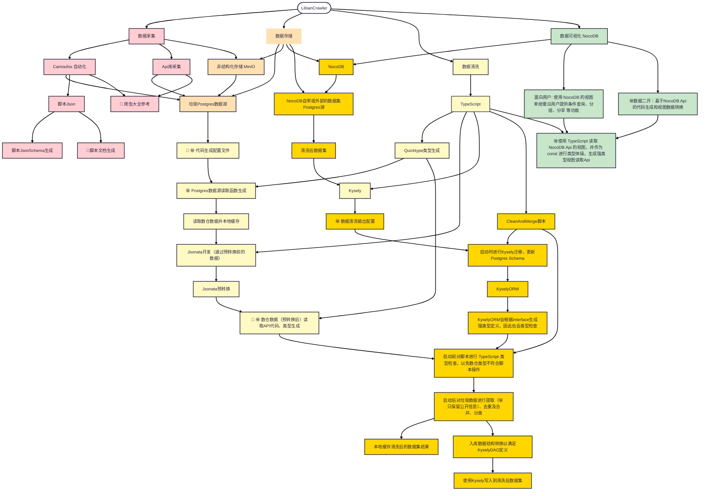

# 1-了解 LibianCrawler

LibianCrawler 是一套数据采集、清洗、存储、展示、二开的工具集。

由于具体功能说起来太复杂，所以请放大查看下图。

> 🔗 表示可以点击查看相关文档。
>
> ㊙️ 表示这些私人代码是被排除在框架代码外的，框架不会包含隐私代码，但会提供常用工具。 

[//]: # (LibianCrawler 是一个模块化的数据处理框架，专为解决传统工具在 数据采集、数据清洗、数据存储、数据展示 和 数据计算 阶段中常见的工程问题而设计。通过整合一系列先进的技术和工具，LibianCrawler 能够高效地构建并输出高质量的数据集，同时支持与大语言模型（LLM）无缝对接，以实现各阶段脚本的自动化编写和优化。)

[//]: # ()
[//]: # (传统工具在上述五个阶段中通常会遇到以下问题：)

[//]: # ()
[//]: # (- **数据采集**：抓取规则复杂、反反爬虫机制多样、分布式抓取效率低下。)

[//]: # (- **数据清洗**：数据格式混乱、缺失值处理困难、清洗逻辑复杂且难以维护。)

[//]: # (- **数据存储**：海量数据存储与管理效率低下，结构化与非结构化数据处理不统一。)

[//]: # (- **数据展示**：数据可视化工具功能有限，无法满足多样化的展示需求。)

[//]: # (- **数据保护**：配置文件 和 数据结构中敏感字段 会在业务代码的版本管理中泄漏; 运行时没有权限管理。)

[//]: # (- **数据计算**：计算能力受限，难以高效处理大规模数据，且与 LLM 的集成支持不足。)

[//]: # ()
[//]: # (LibianCrawler 针对这些痛点，提供了全面的解决方案。接下来，我们将详细介绍其核心模块和功能。)

